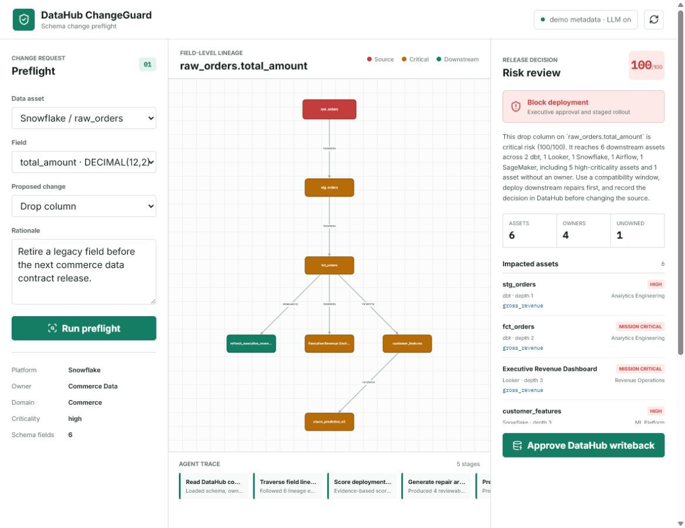
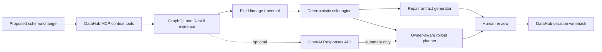

# DataHub ChangeGuard



DataHub ChangeGuard checks a proposed schema change before it reaches production. It
reads field lineage, ownership, domains, schemas, and criticality from DataHub, then:

1. calculates the downstream blast radius;
2. produces an evidence-based release risk score;
3. generates reviewable SQL, dbt tests, CI gates and a decision record;
4. creates an owner-aware rollout plan; and
5. writes the approved decision and follow-up actions back to DataHub.

The demo follows a Snowflake field through dbt, Looker, a feature table, a production
model, and an Airflow job. It runs without credentials. A connected DataHub instance and
OpenAI summary generation are optional.

## Why this project

A field used by several teams can break transformations, dashboards, features, models,
and scheduled jobs at the same time. ChangeGuard checks those consumers, names their
owners, generates the repair files, and records the approved decision in DataHub.

## Run locally

```powershell
python -m venv .venv
.\.venv\Scripts\python -m pip install -e ".[dev]"
.\.venv\Scripts\python -m uvicorn app.main:app --reload --port 8765
```

Open `http://127.0.0.1:8765`.

The default scenario proposes dropping `raw_orders.total_amount`. It demonstrates a
field-level impact path through revenue reporting and churn prediction.

## Connect a DataHub instance

ChangeGuard's real mode uses the DataHub MCP Server for agent context and DataHub's
GraphQL/Rest.li APIs for structured reads and governed writeback:

```powershell
$env:CHANGEGUARD_MODE="datahub"
$env:DATAHUB_GMS_URL="https://your-datahub.example.com"
$env:DATAHUB_MCP_URL="https://your-datahub.example.com/mcp"
$env:DATAHUB_TOKEN="..."
$env:CHANGEGUARD_PUBLIC_URL="https://changeguard.example.com"
.\.venv\Scripts\python -m uvicorn app.main:app --port 8765
```

Before every preflight, the agent calls the MCP tools `get_entities`,
`list_schema_fields`, and `get_lineage`. It then reads structured entity aspects from
`entitiesV2`, expands the graph with `scrollAcrossLineage`, and records approved decisions
using DataHub incidents and institutional-memory links. Keep `CHANGEGUARD_MODE=demo` for
the credential-free judging path.

## Optional OpenAI planning layer

Set the following environment variables before starting the server:

```powershell
$env:OPENAI_API_KEY="..."
$env:OPENAI_MODEL="gpt-5.4-mini"
```

ChangeGuard uses the OpenAI Responses API only to improve the executive summary. Risk
scoring, lineage traversal, repair generation and writeback planning remain deterministic
and auditable.

## API

- `GET /api/status` - runtime and integration status
- `GET /api/entities` - selectable DataHub entities
- `POST /api/analyze` - run a schema-change preflight
- `GET /api/analyses/{id}` - retrieve a completed analysis
- `POST /api/analyses/{id}/apply` - approve and apply/simulate DataHub writeback
- `GET /api/audit` - audit trail

Example:

```json
{
  "entity_urn": "urn:li:dataset:(urn:li:dataPlatform:snowflake,commerce.raw_orders,PROD)",
  "field": "total_amount",
  "change_type": "drop_column",
  "rationale": "Retire a legacy field before the next data contract release."
}
```

## Generated artifacts

- backward-compatible SQL adapter;
- dbt schema tests linked to the affected field;
- GitHub Actions pre-merge gate; and
- an auditable Markdown change decision.

Static examples for the default scenario are available in
[`examples/generated`](examples/generated). Devpost copy, the demo script, and the final
submission checklist are in [`submission`](submission).

## Hackathon disclosure

ChangeGuard was created during the July 6 to August 10, 2026 submission period. It uses
the standard open-source dependencies declared in `pyproject.toml`; no pre-existing
proprietary project code is included.

## Tests

```powershell
.\.venv\Scripts\python -m pytest
```

## Architecture



## License

Apache License 2.0.
